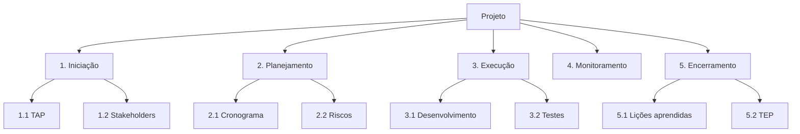

[03-escopo-eap.md](https://github.com/user-attachments/files/30235324/03-escopo-eap.md)
# 🧱 Escopo e Estrutura Analítica do Projeto (EAP/WBS)

## Declaração de escopo
<!-- Descrição clara do que será entregue -->

## EAP (Mermaid)

## Dicionário da EAP
| Código | Pacote de trabalho | Entrega | Critério de aceite |
|--------|--------------------|---------|--------------------|
| 1.1    | TAP                | Documento assinado | Aprovação do sponsor |
